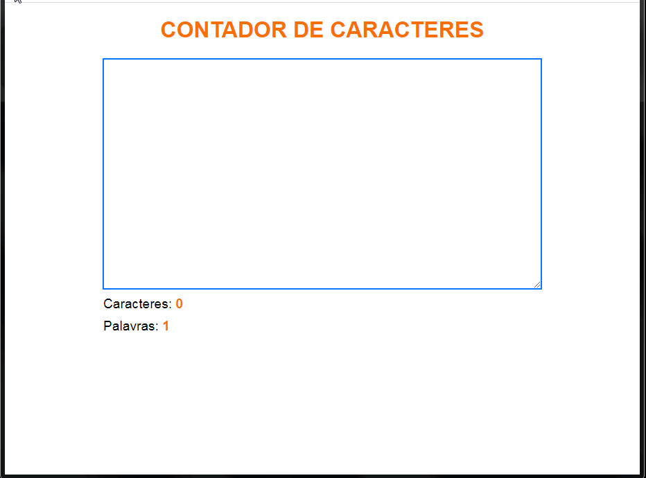

# Contador de caractere

## Javascript & Jquery

- Projeto de contador de caracter, onde o usuário insere textos, digitando ou mesmo através de copiar e colar.

- Tecnologias usadas Html, CSS, Javascript e Jquery.

- Através do exercício foi aprendido a manipulação do DOM.

- Projeto desenvolvido no curso da Origamid.

  

  

    
  

  

